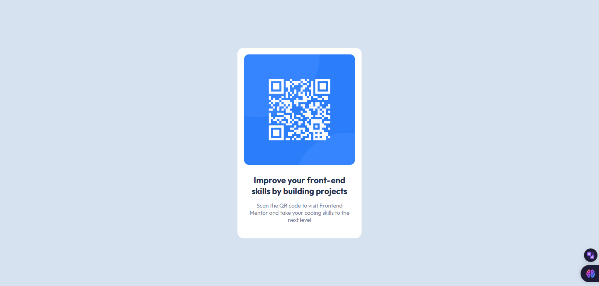

# Frontend Mentor - QR code component solution

This is a solution to the [QR code component challenge on Frontend Mentor](https://www.frontendmentor.io/challenges/qr-code-component-iux_sIO_H). Frontend Mentor challenges help you improve your coding skills by building realistic projects. 

## Table of contents

- [Overview](#overview)
  - [Screenshot](#screenshot)
  - [Links](#links)
- [My process](#my-process)
  - [Built with](#built-with)
  - [What I learned](#what-i-learned)
  - [Continued development](#continued-development)
  - [Useful resources](#useful-resources)
- [Author](#author)

## Overview

In this project, I developed a modern and responsive component that allows users to generate dynamic QR codes from different types of data, such as URLs, texts or structured information. The component is easy to integrate into existing projects and offers an intuitive user experience.

### Screenshot



### Links

- Solution URL: [QR-CODE SOLUTION](https://qr-code-component-gold-mu.vercel.app/)

## My process

### Built with

- Semantic HTML5 markup
- CSS custom properties
- Flexbox

### What I learned

Flexbox revolutionized the way we organize layouts and elements on web pages in a responsive way. This week, I took some time to improve my knowledge of this powerful resource.

I learned that with flexbox it is possible to design fluid interfaces in a semantic and responsive way, aligning items and organizing the flow in an intuitive way.

```css
.card {
    background-color: hsl(0, 0%, 100%);
    padding: 18px;
    border-radius: 17px;
    text-align: center;
    margin: 0 1em;
}
```

### Continued development

Over the last few months I've been delving deeper into the Vue.js progressive JavaScript framework. In addition to knowing its main concepts of reactivity and components, I started to adopt a continuous development (CD) methodology, where I apply small improvements to the code on a constant basis.

This helps me evolve my skills as a developer gradually, validating improvements continuously through Vue CLI and CI/CD tools. With each pull request, my colleagues also evaluate the quality and maintainability of the code.

With Vue devtools, it's easy to inspect the state of your applications and debug in real time. Vue Test Utils makes it easier to write unit and integration tests for new features.

Adopting agile practices like CD motivates me to regularly contribute to significant changes, rather than big releases. This keeps the project healthy and helps me progress in learning Vue incrementally.

### Useful resources

- [Conceitos básicos de flexbox](https://developer.mozilla.org/pt-BR/docs/Web/CSS/CSS_flexible_box_layout/Basic_concepts_of_flexbox) - This helped me about Flexbox Basics. I really liked this pattern and will use it from now on.

## Author

- LinkedIn - [Paulo Pessoa](https://www.linkedin.com/in/mr-cerebro/)
- Frontend Mentor - [@mr-cerebro](https://www.frontendmentor.io/profile/mr-cerebro)
- Twitter - [@PauloPe65041263](https://twitter.com/PauloPe65041263)